# Flood Mobile App

<!-- TABLE OF CONTENTS -->

  
Table of Contents

  <ol>
    <li>
      <a href="#about-the-project">About The Project</a>
      <ul>
        <li><a href="#supported-clients">Supported Clients</a></li>
        <li><a href="#built-with">Built With</a></li>
      </ul>
    </li>
    <li><a href="#usage & screenshot">Usage & Screenshots</a></li>
    <li><a href="#roadmap">Roadmap</a></li>
  </ol>

<!-- ABOUT THE PROJECT -->

## About The Project

Flood is a monitoring service for various torrent clients. It's a Node.js service that communicates with your favorite
torrent client and serves a decent mobile UI for administration. The web app and other relevant documentation can be
found at [Flood](https://github.com/jesec/flood).

#### Supported Clients

| Client                                                          | Support                                                                                                      |
| --------------------------------------------------------------- | ------------------------------------------------------------------------------------------------------------ |
| [rTorrent](https://github.com/rakshasa/rtorrent)                | :white_check_mark: ([tested](https://github.com/jesec/flood/blob/master/server/.jest/rtorrent.setup.js))     |
| [qBittorrent](https://github.com/qbittorrent/qBittorrent) v4.1+ | :white_check_mark: ([tested](https://github.com/jesec/flood/blob/master/server/.jest/qbittorrent.setup.js))  |
| [Transmission](https://github.com/transmission/transmission)    | :white_check_mark: ([tested](https://github.com/jesec/flood/blob/master/server/.jest/transmission.setup.js)) |

### Built With

- [Dart](https://dart.dev/)
- [Flutter](https://flutter.dev/)
- [flutter_client_sse](https://github.com/pratikbaid3/flutter_client_sse)

<!-- GETTING STARTED & CONTRIBUTING -->

## Getting started & Contribution guide

[CONTRIBUTING.md](https://github.com/CCExtractor/Flood_Mobile/blob/master/CONTRIBUTING.md)

<!-- USAGE EXAMPLES -->

## Usage & Screenshots

## Dark Mode

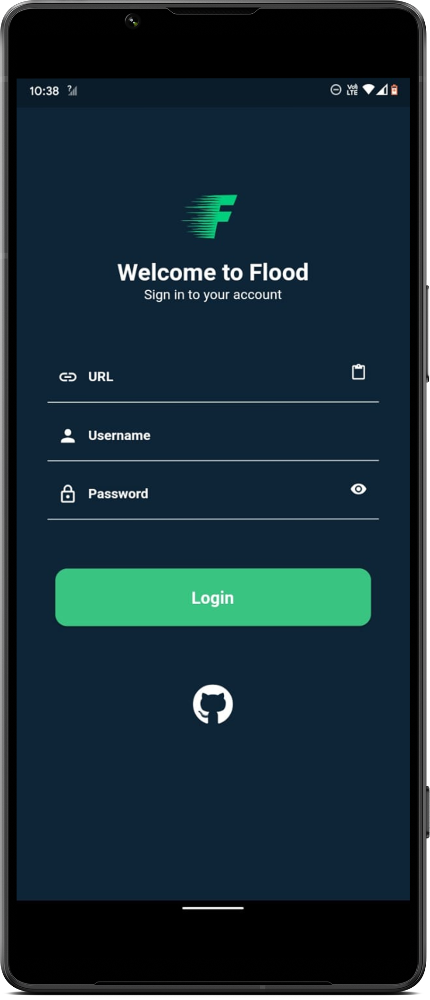</img>
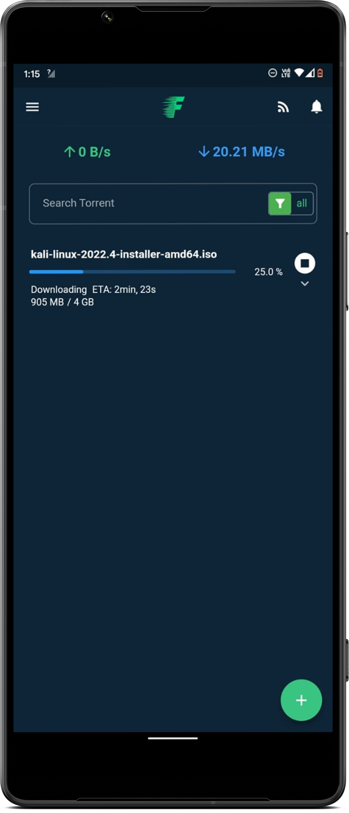</img>
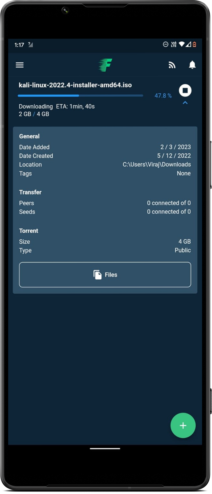</img>
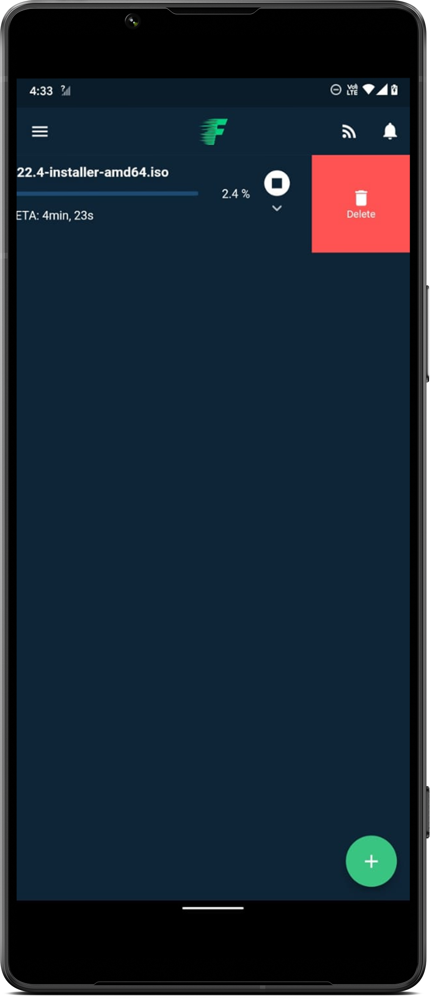</img>
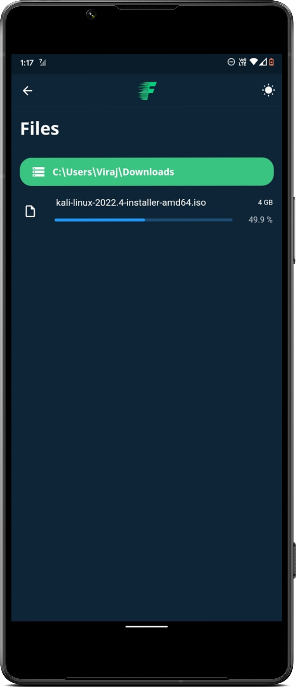</img>
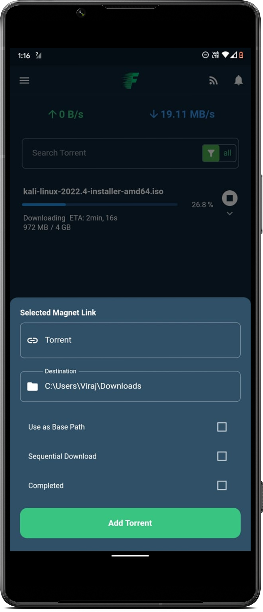</img>
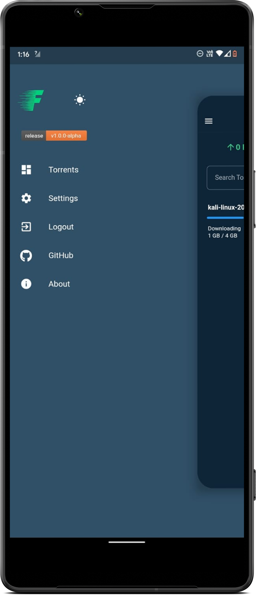</img>
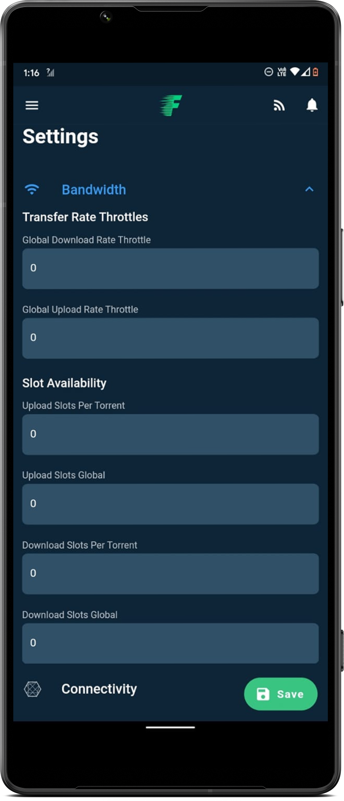</img>
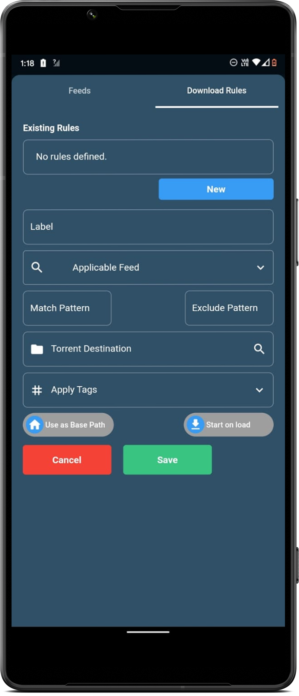</img>

## Light Mode

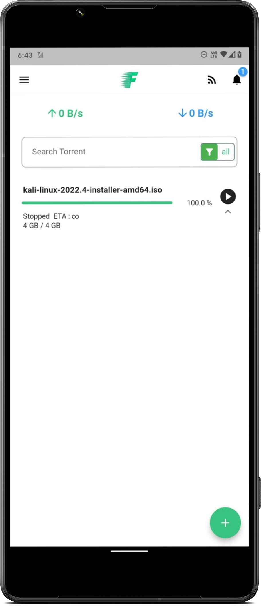</img>
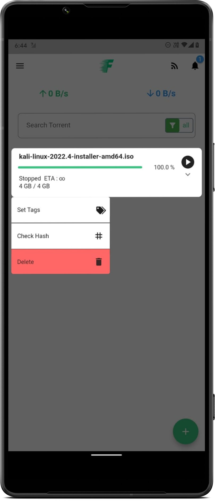</img>
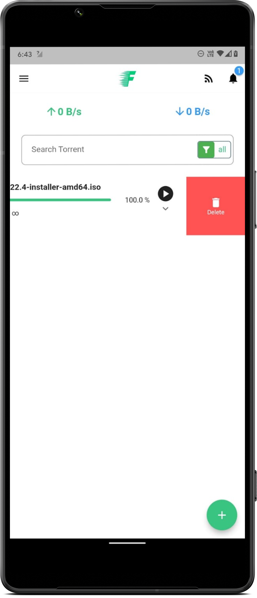</img>
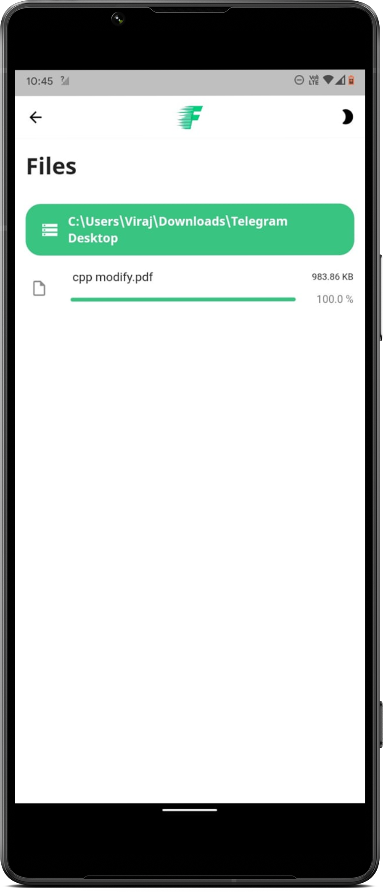</img>
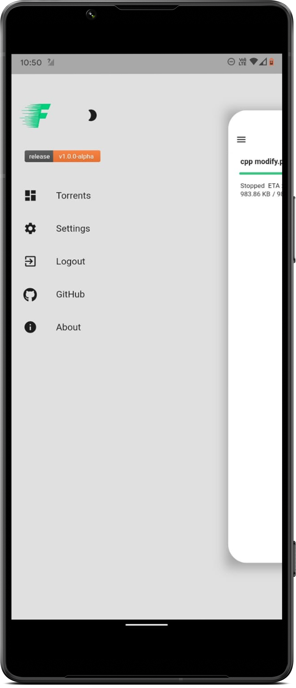</img>
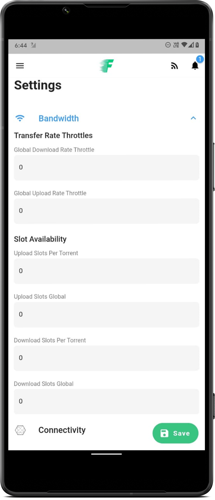</img>

<!-- ROADMAP -->

## Roadmap

Coming Soon!

<!-- CONTACT -->

## Contact

[Pratik Baid](https://www.linkedin.com/in/pratik-baid-aa253980/)
Project Link: [Flood_Mobile](https://github.com/CCExtractor/Flood_Mobile)
